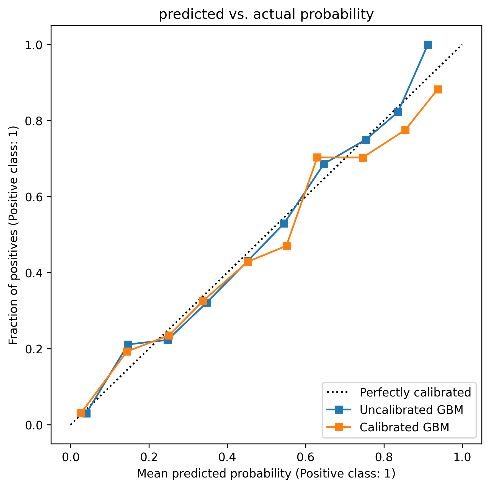
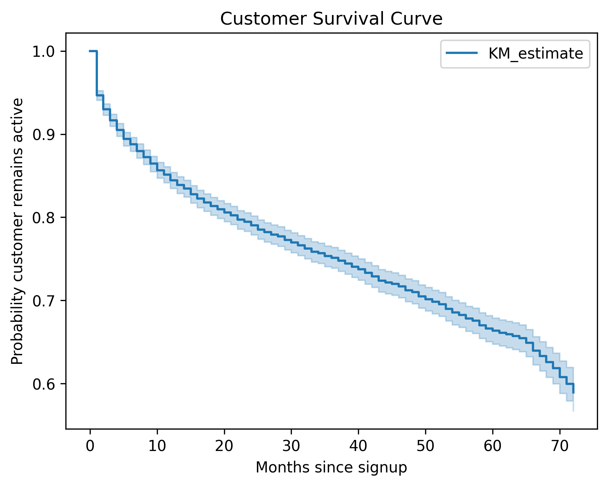
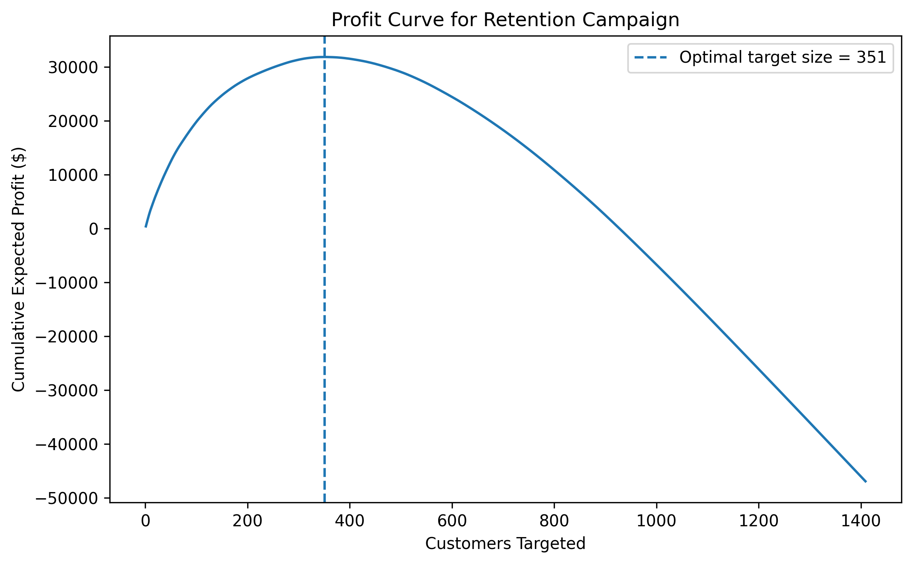

# Telecom Customer Churn Prediction and Profit-Optimized Retention Strategy

## Section 1 - Executive Summary
This project builds a customer churn prediction model for a telecommunications dataset and creates a retention simulation to maximize profit. Rather than treating churn prediction as a classification problem, this project reframes it as a business decision problem:

Which customers should be targeted, and what intervention tier maximizes expected profit?

Using calibrated churn probabilities and expected customer value, the final strategy:
- Achieves a PR-AUC of 0.69 on a dataset with a 26.5% churn rate
- Identifies 351 high-risk customers for intervention
- Generates USD 31,817.11 in expected profit

## Section 2 - Problem Statement
Telecom companies can face significant revenue loss due to customer churn. Retention efforts (discounts, upgrades, incentives) are costly, so targeting the wrong customers reduces profitability.

The goal of this project is to:
1. Predict the probability that a customer will churn
2. Estimate the future value of each customer
3. Allocate retention resources to maximize expected profit

## Section 3 - Data Overview
The dataset consists of 7,043 customer records, where each row represents a single customer. Customer-level information includes:
- Subscription details (contract type, tenure, charges)
- Customer demographic and household information (age, gender, family situation)
- Target variable: Churn (binary)

The dataset is moderately imbalanced, with a 26.5% churn rate, making ranking-based metrics more appropriate than accuracy.

## Section 4 - Modeling Approach
### Preprocessing
- One-hot encoding for categorical features
- Used pipelines for reproducibility and consistency

### Models Selected
1. Logistic Regression
2. Random Forest
3. XGBoost
4. Gradient Boosting (scikit-learn)

### Evaluation Strategy
- Primary metric: PR-AUC
- Cross-validation used to check model stability
- Train/test comparison used to monitor overfitting

### Model Evaluation
| Model               | PR-AUC Mean | Train PR-AUC | Test PR-AUC | Gap   |
|---------------------|-------------|--------------|-------------|-------|
| GBM (sklearn)       | 0.691       | 0.720        | 0.674       | 0.047 |
| XGBoost             | 0.690       | 0.740        | 0.672       | 0.068 |
| Random Forest       | 0.674       | 0.693        | 0.659       | 0.034 |
| Logistic Regression | 0.680       | 0.686        | 0.646       | 0.041 |

Final Model: Gradient Boosting (sklearn)

Gradient Boosting (scikit-learn) was selected as the final model because it achieved the highest cross-validated PR-AUC while maintaining a reasonable train/test generalization gap.

## Section 5 - Probability Calibration
Tree-based models often produce poorly calibrated results. Since we are using these probabilities to make business decisions rather than just classification, it is important we properly calibrate.

To address this:
- Applied isotonic calibration
- Evaluated using Brier score and reliability curves

### Results
- Brier score (uncalibrated): 0.1325
- Brier score (calibrated): 0.1328

While calibration did not have a significant impact on Brier score, calibration was still applied because:
- It improves interpretability of predicted probabilities
- It ensures probabilities can be used in business calculations
- It can help reduce overconfidence commonly observed in tree-based models.

## Section 6 - Customer Value (CLV)
Customer value was estimated using survival analysis rather than a fixed assumption. The Kaplan-Meier estimator was used because the dataset is cross-sectional rather than fully longitudinal, limiting the use of more advanced time-varying survival models.
- Kaplan-Meier estimator used to model retention over time
- Expected customer value calculated over a 24-month horizon

This gives us a more accurate profit estimate rather than just using churn risk. Since the dataset does not give us the full timeline of each customer, the survival curve is used to estimate value and not to forecast exact customer lifetime.

## Section 7 - Profit-Optimized Retention Strategy
Customers are ranked and targeted by expected profit:

$$
\text{Expected Profit}
=
P(\text{churn})
\times
P(\text{save})
\times
\text{CLV}
-
\text{Cost}
$$

Two intervention tiers were used for the simulation:
- Upgrade offer (higher cost, higher success rate)
- Discount offer (lower cost, lower success rate)

The simulation required these assumptions:
- Upgrade cost: USD 250
- Discount cost: USD 100
- Upgrade success rate: 30%
- Discount success rate: 15%

For each customer, expected profit is calculated for both actions and the optimal action is selected. Customers with negative expected value are excluded and the remaining customers are ranked by expected profit. The optimal campaign size is then determined by maximizing cumulative expected profit.

## Section 8 - Results and Business Impact
- Total customers targeted: 351
- Total expected profit: USD 31,817.11
- Customers targeted for upgrade: 196
- Customers targeted for discount: 155
- Expected profit from upgrade: USD 27,651.77
- Expected profit from discount: USD 4,165.34

## Section 9 - Key Takeaways and Future Improvements
This project demonstrates a full pipeline from:
- churn prediction -> probability calibration -> customer value estimation -> decision optimization

Instead of converting probabilities into binary churn predictions, calibrated probabilities were used directly in expected profit calculations.

Future improvements:
- Add budget constraints to enhance profit simulation
- Validate assumptions with real data